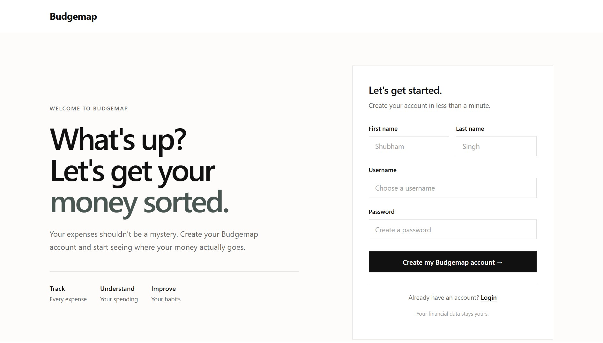
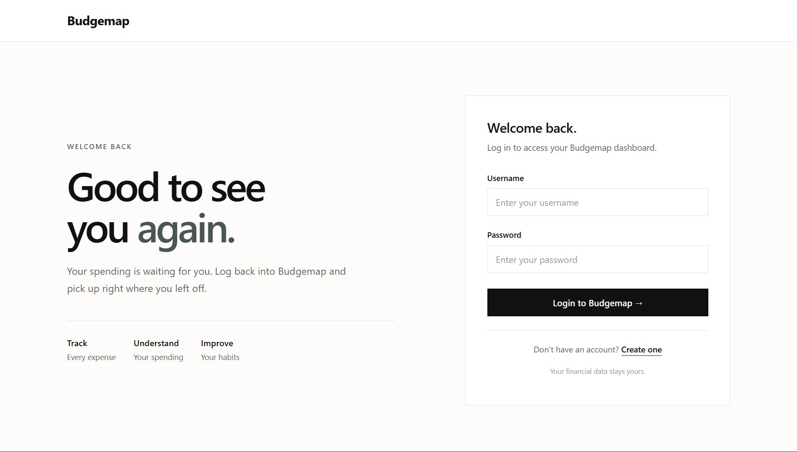

#  Budgemap

A simple and modern expense tracking application built with Django to help users track spending, manage expenses, and understand their financial habits.

## 🧑‍💻Live Demo

[**Open Budgemap →**](https://expense-production-4c4e.up.railway.app/)






## ✨ Features

* User registration and authentication
* Expense tracking
* Expense categorization
* Account balance management
* AI-powered expense summaries
* Responsive and animated interface

## 🛠️ Tech Stack

* **Backend:** Python, Django
* **Database:** SQLite
* **Frontend:** HTML, CSS, JavaScript
* **AI:** Google Gemini API
* **Deployment:** Railway

## 🤖 AI & Development Tools

* **Gemini API** — AI-powered expense summaries
* **Motion** — frontend animations and interactions
* **ChatGPT** — frontend development and debugging assistance
* **Claude** — research, content, and information gathering

## 📁 Project Structure

```text
expense/
├── authenticate/       # Authentication
├── base/               # Expense tracker functionality
├── expense_tracker/    # Django project configuration
├── templates/          # HTML templates
├── manage.py
├── requirements.txt
└── railway.toml        # Railway deployment configuration
```

## ⚙️ Run Locally

### 1. Clone the repository

```bash
git clone https://github.com/TheKai99/expense.git
cd expense
```

### 2. Create a virtual environment

```bash
python -m venv venv
```

Activate it on Windows:

```bash
venv\Scripts\activate
```

### 3. Install dependencies

```bash
pip install -r requirements.txt
```

### 4. Apply migrations

```bash
python manage.py migrate
```

### 5. Start the development server

```bash
python manage.py runserver
```

Open `http://127.0.0.1:8000/` in your browser.

## 🔐 Environment Variables

The Gemini API key should be stored as an environment variable and should **not** be committed to the repository.

```env
GEMINI_API_KEY=your_api_key
```

## 🚧 Future Improvements

* PostgreSQL database
* Expense analytics and visualizations
* Monthly budgets
* Advanced filtering and search
* More detailed financial insights
* Improved mobile experience

---

Built as a learning project to explore **Django, authentication, APIs, AI integration, frontend interactions, and deployment**.
